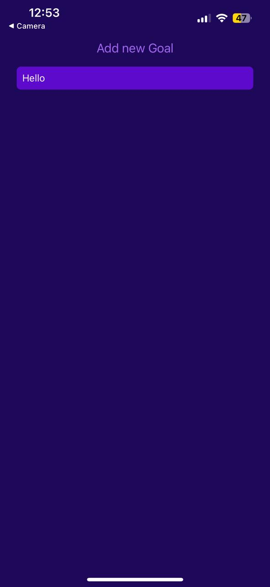
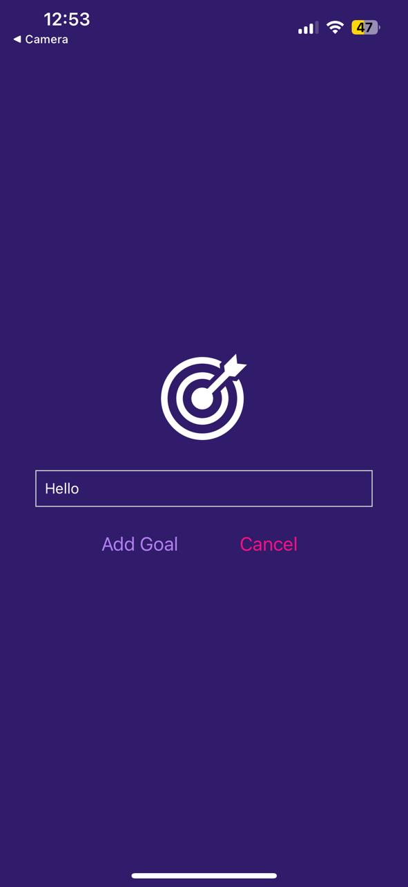

# To-Do List App

## Overview
The To-Do List App is a simple mobile application that allows users to create and manage their to-do lists. It consists of two screens: the first screen contains a text input field where users can enter their to-do items, along with "Cancel" and "Add" buttons. The second screen displays the to-do list, and users can remove items by tapping on them.

## Features
- Add new to-do items.
- View the list of to-do items.
- Remove items from the list by tapping on them.

## Getting Started
To get started with the To-Do List App, follow these steps:

1. Clone the repository to your local machine.
2. Navigate to the project directory.
3. Install any necessary dependencies.
4. Run the app on a mobile device or emulator.

## Usage
1. Open the app on your mobile device.
2. On the first screen, enter a to-do item in the text input field.
3. Tap the "Add" button to add the item to the list.
4. To cancel adding the item, tap the "Cancel" button.
5. Once added, navigate to the second screen to view the list of to-do items.
6. To remove an item from the list, simply tap on it.

## Technologies Used
The To-Do List App is built using the following technologies:

- [React Native](https://reactnative.dev/): A JavaScript framework for building mobile applications.
- [Expo](https://expo.dev/): A platform for building and deploying React Native apps.

  
## Screenshots

### Goals Screen

### Enter Goal Screen

## Installation
1. Clone the repository from GitHub.
2. Navigate to the project directory.
3. Run `npm install` to install dependencies.
4. Run `npm start` to start the development server.
5. Use an Android emulator or iOS simulator to run the application.

## Contributing
Contributions are welcome! If you'd like to contribute to the To-Do List App, please follow these steps:

1. Fork the repository.
2. Create a new branch for your feature or bug fix.
3. Make your changes and commit them to your branch.
4. Push your changes to your fork.
5. Submit a pull request to the main repository.

## Contributors
- **Mohamed El-Maghraby** (Project Lead & Developer)
